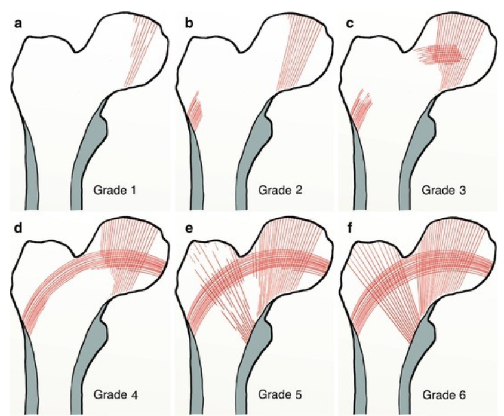
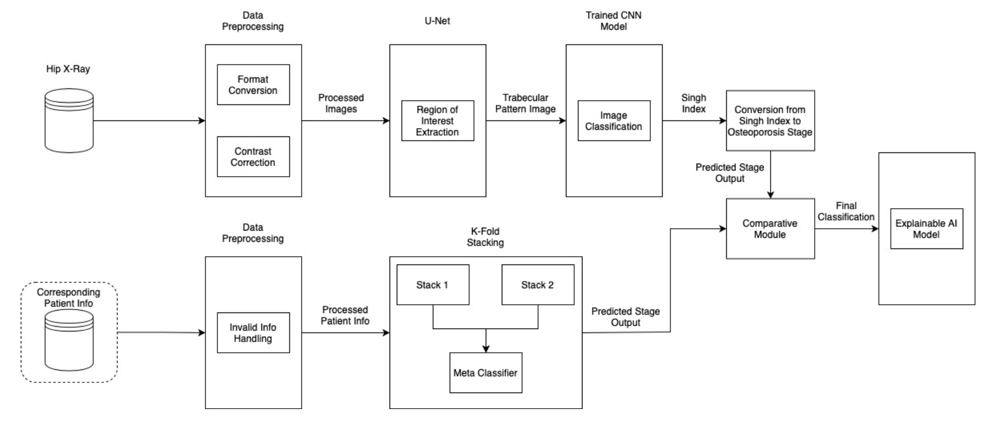

# Osteoporosis Detector Using Explainable AI
## Overview

This is a deep learning generative AI model that will produce a classification of Osteoporotic stage from analyzing an X-ray of a patient's femur.

## Osteoporosis

Osteoporosis is the gradual deterioration of bone structure with time. As age increases, vital vitamins and minerals needed to maintain bone health decrease, leading to weak and brittle bones that are easily susceptible to fractures.

Osteoporosis, especially for hip bones are classified based off the Singh Index

Predicting early osteoporosis is vital. We aim to cover this by developing a screening tool with the help of Machine Learning. 

We aim to utilize dual methodologies for detecting.

•⁠  ⁠An efficient ensemble stacking utilizing Optuna for hyperparameter search

•⁠  ⁠ResNet-34 for X-ray classification based off Singh Index.

