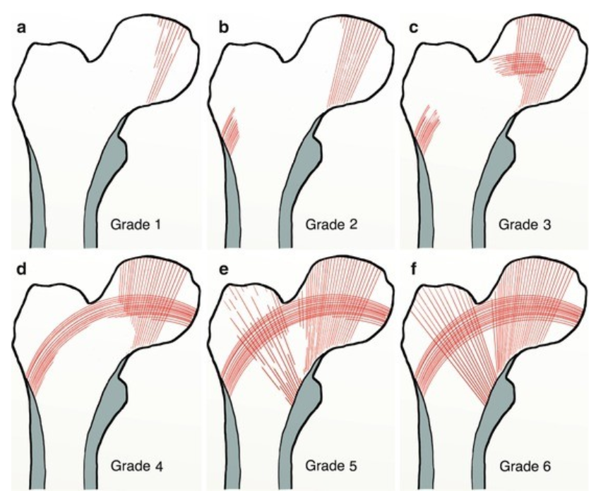
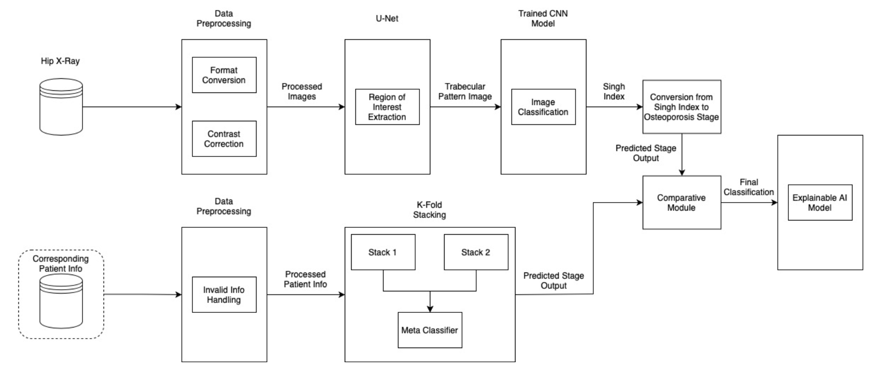
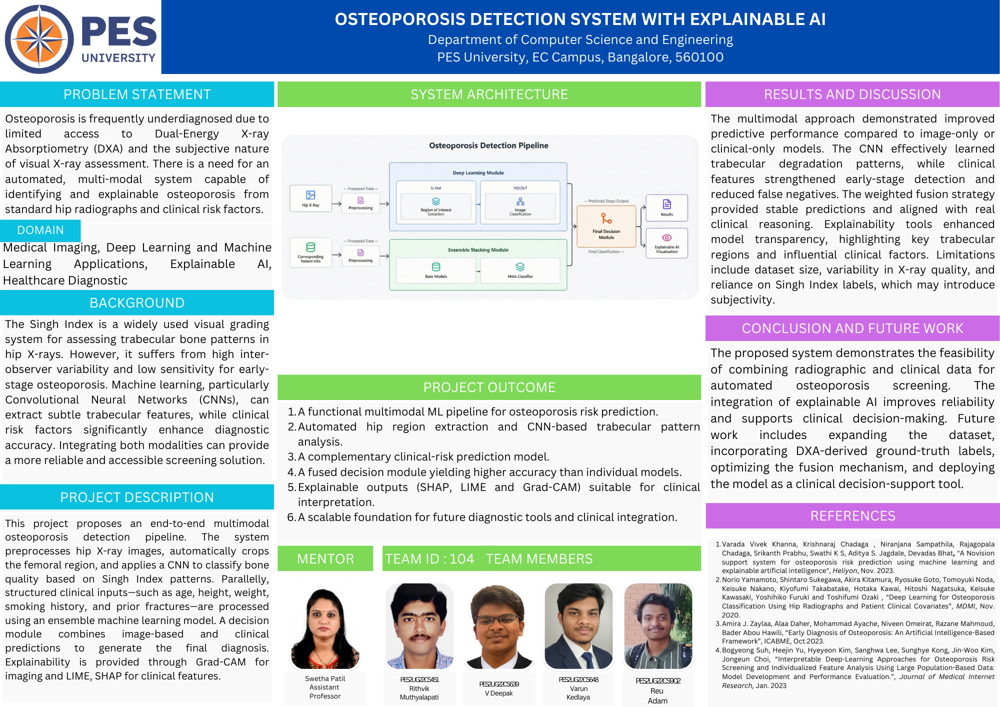

# Osteoporosis Detector Using Explainable AI
>  [!Note]
> This is a deep learning AI model that will produce a classification of Osteoporotic stage from analyzing an X-ray of a patient's hip, specifically the femoral head.

## Overview
Osteoporosis is the gradual deterioration of bone structure with time. As age increases, vital vitamins and minerals needed to maintain bone health decrease, leading to weak and brittle bones that are easily susceptible to fractures.

Osteoporosis, especially for hip bones are classified based off the Singh Index



Predicting early osteoporosis is vital. We aim to cover this by developing a screening tool with the help of Machine Learning.

## Methodology
We aim to utilize dual methodologies for detecting.

•⁠  ⁠An efficient ensemble stacking utilizing Optuna for hyperparameter search

•⁠  U-Net for image segmentation to crop out the hip portion of the x-ray.

•⁠  ⁠YOLOv7 CNN for X-ray classification based off Singh Index.



## Execution
1) Navigate to the home directory and run the command to download the dependencies(you must be in Python 3.10):
   ```bash
   pip3 install -r requirements.txt
   ```
2) Navigate into the (`/UI/`) directory and run the command:
   ```bash
   streamlit run app.py
   ```

## Future Work
We hope to continue work on this project by implementing: 

•⁠  ⁠An LLM trained to interpret the explainable AI outputs to bridge the gap between medical data analysis and the common user's knowledge

•⁠  ⁠A deployable application that can be used on any device

## Developers

